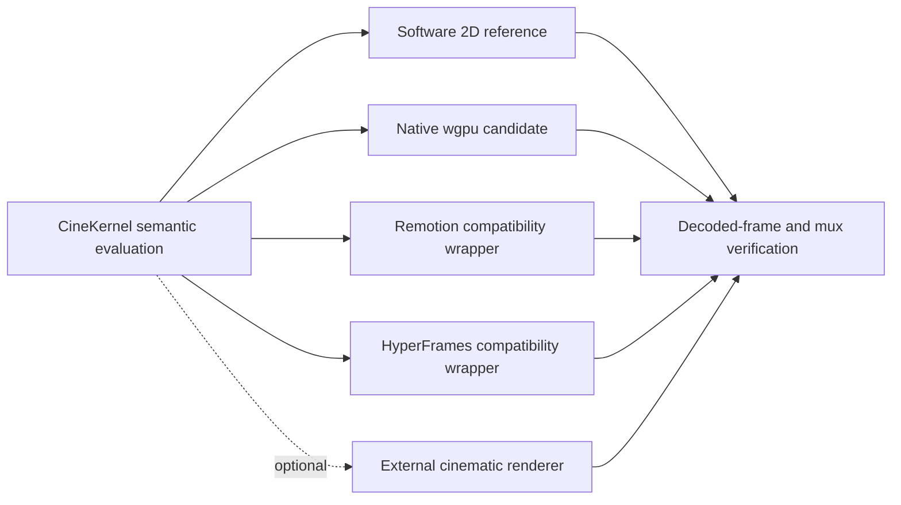

# Renderer roles

- Reference renderer: native software 2D, intentionally slow and testable.
- Certified native candidate: wgpu offscreen 2D/3D plus verified FFmpeg encoding.
- Web compatibility: wrapped Remotion and HyperFrames baselines.
- External cinematic: optional Blender executable only.
- Experimental: Skia/Vello feasibility until cross-platform evidence exists.
