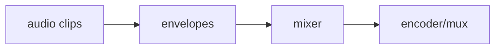

# Audio pipeline

Pinned source: `532caf7aa24fef382cb103013f6414bb547a4129`. Significant claims below use immutable commit links. HyperFrames owns timing in HTML data attributes plus a seekable browser runtime; CineKernel evaluates it as a wrapped web compatibility renderer and a source of protocol/conformance ideas.

| Package / decision | Entrypoint or evidence | Control flow / finding |
|---|---|---|
| engine | [packages/engine/src/services/audioMixer.ts](https://github.com/heygen-com/hyperframes/blob/532caf7aa24fef382cb103013f6414bb547a4129/packages/engine/src/services/audioMixer.ts) | mix graph |
| engine | [packages/engine/src/services/audioVolumeEnvelope.ts](https://github.com/heygen-com/hyperframes/blob/532caf7aa24fef382cb103013f6414bb547a4129/packages/engine/src/services/audioVolumeEnvelope.ts) | automation |
| engine | [packages/engine/src/services/wavChunks.ts](https://github.com/heygen-com/hyperframes/blob/532caf7aa24fef382cb103013f6414bb547a4129/packages/engine/src/services/wavChunks.ts) | PCM chunk handling |

Errors and fallbacks are explicit in engine/producer services; caches require verified anchors; final success still depends on encoded-artifact verification. Recommendation confidence is medium pending full-profile probes.

## Concrete trace and ownership

`parseAudioElements()` extracts registered HTML audio/video elements into typed `AudioElement` records. `prepareAudioTrack()` downloads or extracts media; `extractAudioFromVideo()` handles embedded tracks. `volumeLaneKeyframes()` and `buildVolumeExpression()` simplify automation into bounded FFmpeg expressions. `mixAudioTracks()` combines normalized stereo tracks, while `processCompositionAudio()` owns the public stage and returns `MixResult`. Silence generation handles gaps without inventing registered content.

The composition owns clip intervals, offsets, and volume lanes. The mixer owns temporary PCM/sidecar files and FFmpeg children. The final mux owns codec delay/padding. Download/probe/FFmpeg failures are classified and propagated; the legacy filter-script fallback is used only for a recognized unsupported-option error. Volume simplification is bounded by `MAX_VOLUME_SEGMENTS` and epsilon, a performance cache that must preserve audible intent.

Preview uses browser playback; final render parses, extracts, mixes, encodes, and muxes. Phase 0.1 registers three distinct local WAV files (440/660/880 Hz), includes two silence gaps, and rejects missing/overlap fixtures. Verification decodes AAC to mono 48 kHz, checks sample count with codec tolerance, peak, Goertzel signatures, guarded silence windows, and seam jumps.

Decision: **derive** explicit clip registry and automation lanes, **wrap** the current mixer, **reimplement** audio semantics in the future IR, and **reject** one-tone/self-reported checks. Confidence: **high** for the measured fixture path; **medium** for arbitrary channel layouts/codecs.
