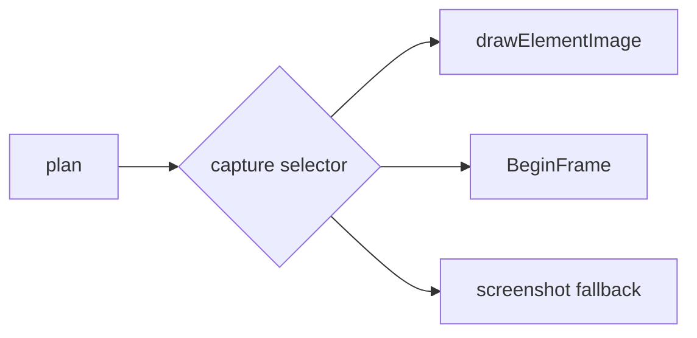

# Capture engine

Pinned source: `532caf7aa24fef382cb103013f6414bb547a4129`. Significant claims below use immutable commit links. HyperFrames owns timing in HTML data attributes plus a seekable browser runtime; CineKernel evaluates it as a wrapped web compatibility renderer and a source of protocol/conformance ideas.

| Package / decision | Entrypoint or evidence | Control flow / finding |
|---|---|---|
| engine | [packages/engine/src/services/frameCapture.ts](https://github.com/heygen-com/hyperframes/blob/532caf7aa24fef382cb103013f6414bb547a4129/packages/engine/src/services/frameCapture.ts) | seek/capture lifecycle |
| engine | [packages/engine/src/services/screenshotService.ts](https://github.com/heygen-com/hyperframes/blob/532caf7aa24fef382cb103013f6414bb547a4129/packages/engine/src/services/screenshotService.ts) | BeginFrame and screenshot |
| engine | [packages/engine/src/services/drawElementService.ts](https://github.com/heygen-com/hyperframes/blob/532caf7aa24fef382cb103013f6414bb547a4129/packages/engine/src/services/drawElementService.ts) | drawElementImage fast path |
| engine | [packages/engine/src/services/browserManager.ts](https://github.com/heygen-com/hyperframes/blob/532caf7aa24fef382cb103013f6414bb547a4129/packages/engine/src/services/browserManager.ts) | capability probing |

Errors and fallbacks are explicit in engine/producer services; caches require verified anchors; final success still depends on encoded-artifact verification. Recommendation confidence is medium pending full-profile probes.

## Concrete trace and ownership

`createCaptureSession()` constructs a `CaptureSession` and uses rollback if initialization fails. `resolveCaptureSessionOptions()` selects behavior from composition and capability facts. `prepareBeginFrameTimeline()` derives warm-up, commit, and probe ticks; `driveWarmupTicks()` advances the browser deterministically. `beginFrameCapture()` sends CDP BeginFrame with bounded pending-frame retries, while `pageScreenshotCapture()` is the baseline fallback. `resolveDrawElementCaptureMode()` and `detectGpuBackend()` gate the accelerated `produceDrawElementFrame()` route.

The session owns Page/CDP handles, video-frame injection, diagnostic buffers, and cleanup. The render plan owns target time and dimensions. Capture selection owns no semantic state; switching mode must preserve pixels. Browser failures are classified (`isTransientBrowserError`, memory exhaustion, `DrawElementVerificationError`) and only transient operations are retried. `CAPTURE_SESSION_CLOSE_TIMEOUT_MS` bounds close. WeakMap caches are page-scoped and cannot cross session identity.

Preview normally presents DOM directly. Final capture must seek, wait for adapters/media/fonts, inject extracted video frames, select BeginFrame/drawElement/screenshot, and return encoded pixels. Phase 0.1 probes preview/snapshot vs final and records requested/effective capture facts. Decision: **derive** capability classification, rollback, and completion barriers; **wrap** HyperFrames capture; **reimplement** the authoritative native capture scheduler. Confidence: **high** for screenshot/BeginFrame paths, **medium** for drawElement acceleration across GPUs.
