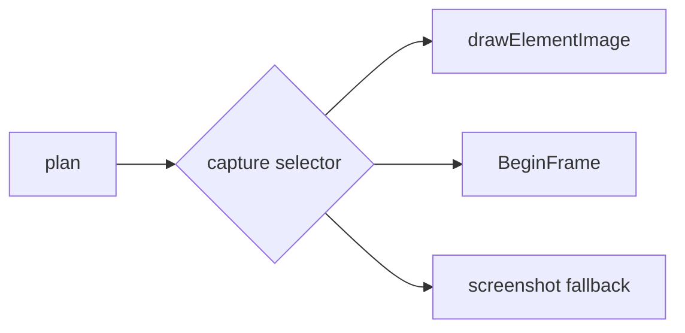

# Capture engine

Pinned source: `532caf7aa24fef382cb103013f6414bb547a4129`. Significant claims below use immutable commit links. HyperFrames owns timing in HTML data attributes plus a seekable browser runtime; CineKernel evaluates it as a wrapped web compatibility renderer and a source of protocol/conformance ideas.

| Package / decision | Entrypoint or evidence | Control flow / finding |
|---|---|---|
| engine | [packages/engine/src/services/frameCapture.ts](https://github.com/heygen-com/hyperframes/blob/532caf7aa24fef382cb103013f6414bb547a4129/packages/engine/src/services/frameCapture.ts) | seek/capture lifecycle |
| engine | [packages/engine/src/services/screenshotService.ts](https://github.com/heygen-com/hyperframes/blob/532caf7aa24fef382cb103013f6414bb547a4129/packages/engine/src/services/screenshotService.ts) | BeginFrame and screenshot |
| engine | [packages/engine/src/services/drawElementService.ts](https://github.com/heygen-com/hyperframes/blob/532caf7aa24fef382cb103013f6414bb547a4129/packages/engine/src/services/drawElementService.ts) | drawElementImage fast path |
| engine | [packages/engine/src/services/browserManager.ts](https://github.com/heygen-com/hyperframes/blob/532caf7aa24fef382cb103013f6414bb547a4129/packages/engine/src/services/browserManager.ts) | capability probing |

Errors and fallbacks are explicit in engine/producer services; caches require verified anchors; final success still depends on encoded-artifact verification. Recommendation confidence is medium pending full-profile probes.

