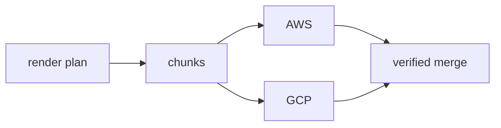

# Distributed rendering

Pinned source: `532caf7aa24fef382cb103013f6414bb547a4129`. Significant claims below use immutable commit links. HyperFrames owns timing in HTML data attributes plus a seekable browser runtime; CineKernel evaluates it as a wrapped web compatibility renderer and a source of protocol/conformance ideas.

| Package / decision | Entrypoint or evidence | Control flow / finding |
|---|---|---|
| aws-lambda | [packages/aws-lambda/src](https://github.com/heygen-com/hyperframes/blob/532caf7aa24fef382cb103013f6414bb547a4129/packages/aws-lambda/src) | AWS execution |
| gcp-cloud-run | [packages/gcp-cloud-run/src](https://github.com/heygen-com/hyperframes/blob/532caf7aa24fef382cb103013f6414bb547a4129/packages/gcp-cloud-run/src) | GCP execution |
| producer | [packages/producer/src/distributed.ts](https://github.com/heygen-com/hyperframes/blob/532caf7aa24fef382cb103013f6414bb547a4129/packages/producer/src/distributed.ts) | distributed contract |

Errors and fallbacks are explicit in engine/producer services; caches require verified anchors; final success still depends on encoded-artifact verification. Recommendation confidence is medium pending full-profile probes.

## Concrete trace and ownership

`producer/src/distributed.ts` exports planning, chunk rendering, assembly, project hashing, and typed distributed-format contracts. V2 execution separates `renderChunkV2` from `assembleV2`; project hashes bind workers to frozen input. AWS Lambda and GCP Cloud Run packages supply provider execution around the shared plan rather than redefining composition time.

The coordinator owns plan identity, chunk ranges, retries, and final assembly. Workers own isolated browser/encoder resources for their assigned range. Object storage owns exchanged artifacts. Chunk identifiers and hashes, not completion order, establish assembly order. Provider retries must be idempotent and cannot silently mix project revisions. Assembly errors and missing chunks reject.

Local preview is unrelated to this lifecycle; local final render still shares plan/capture/encode ideas but not provider failure modes. Phase 0.1 does not execute AWS/GCP and makes no performance or reliability claim for them. The canonical implementation revision/spec/lock hashing is deliberately compatible with future distributed input identity.

Decision: **derive** immutable plan hashes, ordinal chunks, idempotent workers, and verified assembly; **defer/reimplement** provider-neutral orchestration in a later phase; **wrap** upstream provider support only for HyperFrames compatibility. Confidence: **high** in the static trace, **low** in unexecuted operations.
