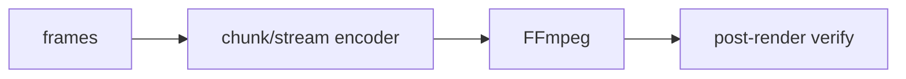

# Producer and encoding

Pinned source: `532caf7aa24fef382cb103013f6414bb547a4129`. Significant claims below use immutable commit links. HyperFrames owns timing in HTML data attributes plus a seekable browser runtime; CineKernel evaluates it as a wrapped web compatibility renderer and a source of protocol/conformance ideas.

| Package / decision | Entrypoint or evidence | Control flow / finding |
|---|---|---|
| engine | [packages/engine/src/services/chunkEncoder.ts](https://github.com/heygen-com/hyperframes/blob/532caf7aa24fef382cb103013f6414bb547a4129/packages/engine/src/services/chunkEncoder.ts) | chunk encoding |
| engine | [packages/engine/src/services/streamingEncoder.ts](https://github.com/heygen-com/hyperframes/blob/532caf7aa24fef382cb103013f6414bb547a4129/packages/engine/src/services/streamingEncoder.ts) | bounded streaming encode |
| producer | [packages/producer/src/renderRequest.ts](https://github.com/heygen-com/hyperframes/blob/532caf7aa24fef382cb103013f6414bb547a4129/packages/producer/src/renderRequest.ts) | final request lifecycle |

Errors and fallbacks are explicit in engine/producer services; caches require verified anchors; final success still depends on encoded-artifact verification. Recommendation confidence is medium pending full-profile probes.

## Concrete trace and ownership

`buildEncoderArgs()` normalizes codec/container/quality inputs. `encodeFramesFromDir()` and `encodeFramesChunkedConcat()` consume completed frame files; `spawnStreamingEncoder()` instead exposes a bounded `FrameReorderBuffer` created by `createFrameReorderBuffer(start,end)`. The buffer accepts out-of-order capture but releases frames ordinally to FFmpeg. `muxVideoWithAudio()` and `applyFaststart()` complete MP4 assembly. Producer `renderRequest` coordinates the request lifecycle around these services.

Capture workers own pixel production; the reorder buffer owns only pending encoded frames; FFmpeg owns compression; the producer owns temp paths and cancellation. Backpressure is required when the consumer is slower than capture. Encoder timeout/stderr failures reject, and mux never converts a failed video/audio stage into success. Presets and GPU encoder choice affect comparability and must be recorded.

Preview skips this lifecycle. Final render adds chunk/stream assembly, audio mux, fast-start, and artifact validation. CineKernel Probe J feeds real 1920×1080×4 buffers through a capacity-three queue to a deliberately slow real FFmpeg consumer and records maximum depth/RSS. The central verifier then checks the finished mux.

Decision: **derive** bounded reorder/backpressure and staged encoder ownership, **wrap** HyperFrames encoding for compatibility, **reimplement** canonical metrics and verification, and **reject** unbounded frame accumulation. Confidence: **high** in structure, **medium** in performance claims until full repetitions pass.
