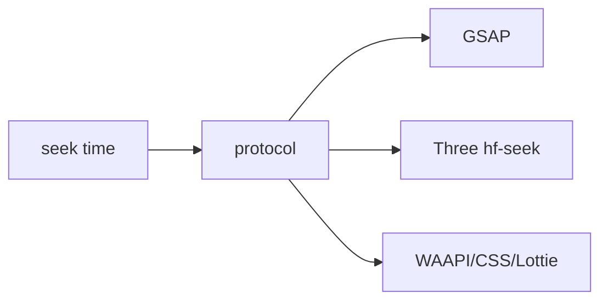

# Runtime and seek protocol

Pinned source: `532caf7aa24fef382cb103013f6414bb547a4129`. Significant claims below use immutable commit links. HyperFrames owns timing in HTML data attributes plus a seekable browser runtime; CineKernel evaluates it as a wrapped web compatibility renderer and a source of protocol/conformance ideas.

| Package / decision | Entrypoint or evidence | Control flow / finding |
|---|---|---|
| core | [packages/core/src/runtime/protocol.ts](https://github.com/heygen-com/hyperframes/blob/532caf7aa24fef382cb103013f6414bb547a4129/packages/core/src/runtime/protocol.ts) | window protocol |
| core | [packages/core/src/runtime/adapters/seek-dispatch.ts](https://github.com/heygen-com/hyperframes/blob/532caf7aa24fef382cb103013f6414bb547a4129/packages/core/src/runtime/adapters/seek-dispatch.ts) | adapter fan-out |
| core | [packages/core/src/runtime/adapters/three.ts](https://github.com/heygen-com/hyperframes/blob/532caf7aa24fef382cb103013f6414bb547a4129/packages/core/src/runtime/adapters/three.ts) | Three seek adapter |

Errors and fallbacks are explicit in engine/producer services; caches require verified anchors; final success still depends on encoded-artifact verification. Recommendation confidence is medium pending full-profile probes.

## Concrete trace and ownership

`RuntimeProtocolV1` declares version, rational fps, and capabilities. `runtimeProtocolMetadata()` publishes it; `inspectRuntimeProtocol()` validates it and exposes legacy fallback explicitly. `dispatchSeekEvent()` sends exact seconds through the adapter fan-out, while `forceDispatchSeekEvent()` bypasses dedup when a caller must refresh state. `waitForSeekCompletion()` is the asynchronous barrier and `resetSeekDispatchState()` prevents state leakage between sessions.

The render plan owns frame→time conversion. The runtime owns adapter dispatch state; each GSAP/Three/WAAPI/Lottie/TypeGPU adapter owns its library state. Browser pages own DOM/GPU resources. Rejected adapter promises are aggregated into the seek barrier rather than silently ignored. Seek dedup is a cache-like optimization; forced dispatch and reset are correctness escape hatches. Preview advances continuously, while final capture repeatedly seeks and waits.

Phase 0.1 relies on this boundary for exact-time browser captures and records capture mode/GPU facts. It does not adopt HTML `data-*` state as authoritative VideoIR. Decision: **derive** the versioned rational-fps protocol and completion barrier, **wrap** the current runtime for compatibility, **reimplement** future core evaluation, and **reject** unbarriered seek. Confidence: **high** in the traced protocol; **medium-high** across every optional adapter.
