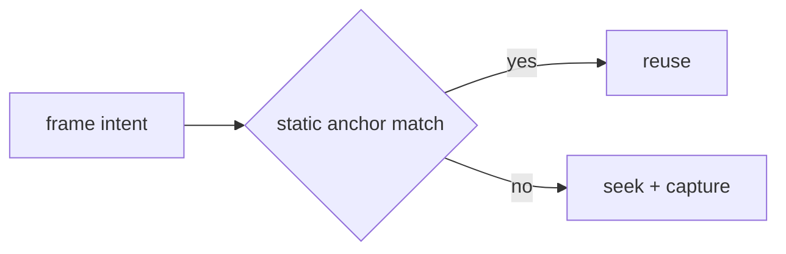

# Static reuse and caching

Pinned source: `532caf7aa24fef382cb103013f6414bb547a4129`. Significant claims below use immutable commit links. HyperFrames owns timing in HTML data attributes plus a seekable browser runtime; CineKernel evaluates it as a wrapped web compatibility renderer and a source of protocol/conformance ideas.

| Package / decision | Entrypoint or evidence | Control flow / finding |
|---|---|---|
| engine | [packages/engine/src/services/frameCapture.ts](https://github.com/heygen-com/hyperframes/blob/532caf7aa24fef382cb103013f6414bb547a4129/packages/engine/src/services/frameCapture.ts) | static dedup index and anchor verification |
| engine | [packages/engine/src/services/extractionCache.ts](https://github.com/heygen-com/hyperframes/blob/532caf7aa24fef382cb103013f6414bb547a4129/packages/engine/src/services/extractionCache.ts) | media extraction cache |
| engine | [packages/engine/src/config.ts](https://github.com/heygen-com/hyperframes/blob/532caf7aa24fef382cb103013f6414bb547a4129/packages/engine/src/config.ts) | HF_STATIC_DEDUP gate |

Errors and fallbacks are explicit in engine/producer services; caches require verified anchors; final success still depends on encoded-artifact verification. Recommendation confidence is medium pending full-profile probes.

## Concrete trace and ownership

Frame capture predicts static ranges, verifies anchors, and reuses pixels only when the before-capture hook/video injection path permits it. Extraction caching is explicit: `computeCacheKey(CacheKeyInput)` hashes canonical source/transform facts; `lookupCacheEntry()` returns hit/miss state; writers publish through a partial directory and `publishCacheEntry()` adopts a winning concurrent publisher; `.hf-complete` marks validity. `rehydrateCacheEntry()` restores frames, and `gcExtractionCache()` applies bounded cleanup.

The cache owns derived bytes, never composition truth. The source file stat and extraction options participate in the key; partial entries are not hits. Concurrent publication handles target-exists races, and access touching/GC are separated from semantic reads. Errors during extraction or anchor verification fall back to capture or reject; they must not reuse an unverified frame.

Preview may keep live decoded state and therefore hides cold-cache behavior. Final rendering can reuse extraction and static-frame results, but Phase 0.1 repeats renders and compares full framemd5 sequences so an incorrect reuse is visible. Media workloads disable static dedup where injection is active.

Decision: **derive** content-addressed keys, atomic publish, completion sentinels, and verified anchors; **reimplement** cache format around authoritative IR; **wrap** upstream cache only inside HyperFrames compatibility. Confidence: **high** in extraction-cache safety structure, **medium** in all static-prediction heuristics.
