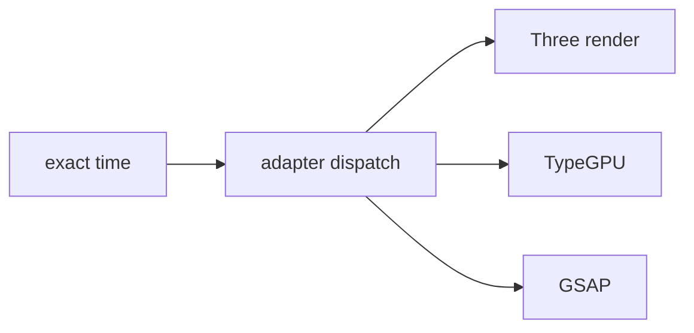

# Three, WebGPU, and adapters

Pinned source: `532caf7aa24fef382cb103013f6414bb547a4129`. Significant claims below use immutable commit links. HyperFrames owns timing in HTML data attributes plus a seekable browser runtime; CineKernel evaluates it as a wrapped web compatibility renderer and a source of protocol/conformance ideas.

| Package / decision | Entrypoint or evidence | Control flow / finding |
|---|---|---|
| core | [packages/core/src/runtime/adapters/three.ts](https://github.com/heygen-com/hyperframes/blob/532caf7aa24fef382cb103013f6414bb547a4129/packages/core/src/runtime/adapters/three.ts) | hf-seek dispatch |
| core | [packages/core/src/runtime/adapters/typegpu.ts](https://github.com/heygen-com/hyperframes/blob/532caf7aa24fef382cb103013f6414bb547a4129/packages/core/src/runtime/adapters/typegpu.ts) | TypeGPU/WebGPU seek |
| core | [packages/core/src/runtime/adapters/gsap.ts](https://github.com/heygen-com/hyperframes/blob/532caf7aa24fef382cb103013f6414bb547a4129/packages/core/src/runtime/adapters/gsap.ts) | paused timeline seek |

Errors and fallbacks are explicit in engine/producer services; caches require verified anchors; final success still depends on encoded-artifact verification. Recommendation confidence is medium pending full-profile probes.

## Concrete trace and ownership

The runtime seek dispatcher emits exact time and awaits adapter completion. The Three adapter discovers registered Three scenes, applies time, renders, and participates in the barrier. TypeGPU performs analogous seek/update work for WebGPU. The GSAP adapter seeks paused timelines rather than relying on wall-clock playback. Other adapters follow the same protocol capability boundary.

Composition code owns deterministic camera/object/animation parameters. Adapters own library-specific state; browser contexts own GPU devices and canvases. Readiness promises and seek completion propagate errors. Adapter registration/dedup behaves as a page cache and must reset per session. Continuous preview may accumulate animation history; final capture must be correct under arbitrary seeks.

Phase 0.1's HyperFrames 3D and mixed cases use a real Three.js canvas, generated local `CanvasTexture`, directional/ambient lighting, camera motion, depth, a 2D overlay, and exact scene checkpoints. GPU mode/backend is captured from renderer logs; snapshots and final extracts are compared numerically. Native wgpu separately supplies adapter/device/driver evidence.

Decision: **derive** adapter protocol and explicit readiness, **wrap** Three/TypeGPU for web compatibility, **reimplement** native scene evaluation, and **reject** elapsed-time-only animation. Confidence: **medium-high** for Three/GSAP; **medium** for TypeGPU/WebGPU portability.
