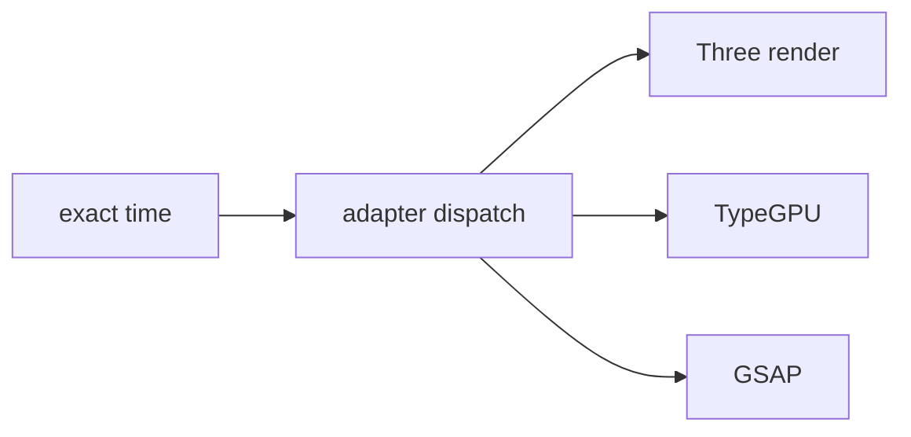

# Three, WebGPU, and adapters

Pinned source: `532caf7aa24fef382cb103013f6414bb547a4129`. Significant claims below use immutable commit links. HyperFrames owns timing in HTML data attributes plus a seekable browser runtime; CineKernel evaluates it as a wrapped web compatibility renderer and a source of protocol/conformance ideas.

| Package / decision | Entrypoint or evidence | Control flow / finding |
|---|---|---|
| core | [packages/core/src/runtime/adapters/three.ts](https://github.com/heygen-com/hyperframes/blob/532caf7aa24fef382cb103013f6414bb547a4129/packages/core/src/runtime/adapters/three.ts) | hf-seek dispatch |
| core | [packages/core/src/runtime/adapters/typegpu.ts](https://github.com/heygen-com/hyperframes/blob/532caf7aa24fef382cb103013f6414bb547a4129/packages/core/src/runtime/adapters/typegpu.ts) | TypeGPU/WebGPU seek |
| core | [packages/core/src/runtime/adapters/gsap.ts](https://github.com/heygen-com/hyperframes/blob/532caf7aa24fef382cb103013f6414bb547a4129/packages/core/src/runtime/adapters/gsap.ts) | paused timeline seek |

Errors and fallbacks are explicit in engine/producer services; caches require verified anchors; final success still depends on encoded-artifact verification. Recommendation confidence is medium pending full-profile probes.

