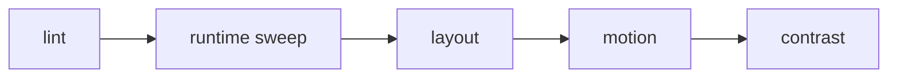

# Validation and checks

Pinned source: `532caf7aa24fef382cb103013f6414bb547a4129`. Significant claims below use immutable commit links. HyperFrames owns timing in HTML data attributes plus a seekable browser runtime; CineKernel evaluates it as a wrapped web compatibility renderer and a source of protocol/conformance ideas.

| Package / decision | Entrypoint or evidence | Control flow / finding |
|---|---|---|
| lint | [packages/lint/src/index.ts](https://github.com/heygen-com/hyperframes/blob/532caf7aa24fef382cb103013f6414bb547a4129/packages/lint/src/index.ts) | static lint |
| cli | [packages/cli/src/commands/check.ts](https://github.com/heygen-com/hyperframes/blob/532caf7aa24fef382cb103013f6414bb547a4129/packages/cli/src/commands/check.ts) | combined check orchestration |
| core | [packages/core/src/runtime/diagnostics.ts](https://github.com/heygen-com/hyperframes/blob/532caf7aa24fef382cb103013f6414bb547a4129/packages/core/src/runtime/diagnostics.ts) | runtime diagnostics |

Errors and fallbacks are explicit in engine/producer services; caches require verified anchors; final success still depends on encoded-artifact verification. Recommendation confidence is medium pending full-profile probes.

## Concrete trace and ownership

The CLI `check` command composes static lint with browser runtime, sampled layout, motion, contrast, and optional snapshot checks. Lint rules own source-level findings; runtime diagnostics own page exceptions/readiness; layout/motion/contrast passes own sampled observations. Strict mode promotes configured findings to process failure. These checks run before each benchmark render and their durations are recorded as preflight, not render time.

Validation is intentionally layered. A clean lint/check result proves the composition is structurally renderable at sampled times; it does not prove every final frame, timestamp, audio window, codec field, or mux. Conversely, the artifact verifier cannot explain every authoring warning. CineKernel retains both records and never substitutes one for the other.

Preview checks use a browser and sampled times, while final verification decodes the actual MP4. Errors propagate through nonzero CLI exit; the harness aborts the repetition and preserves command logs. There is no retry for deterministic lint failure. Caches/browser reuse may accelerate checking but do not change strict outcome.

Decision: **adopt** lint/check as preflight for HyperFrames projects, **derive** layered diagnostics, **reimplement** cross-engine semantic/mux verification, and **reject** sampled validation as acceptance evidence by itself. Confidence: **high** for authoring diagnostics; artifact acceptance depends on the central verifier.
