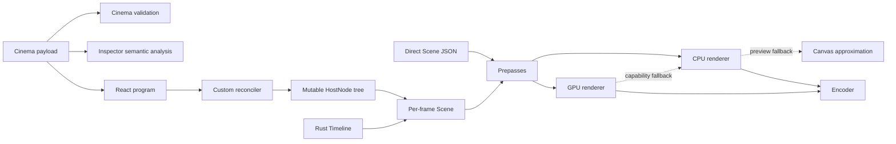

# Architecture overview

The authoritative machine graph contains **15 nodes and 18 edges**. Cinema, React, direct Scene JSON, and typed Rust converge on a finite Scene representation through explicit validation, reconciliation, serialization, prepass, preview, renderer, fallback, and encoder boundaries.

The graph is a compiler map, not a CineKernel implementation design. Every node and edge carries immutable source references.
