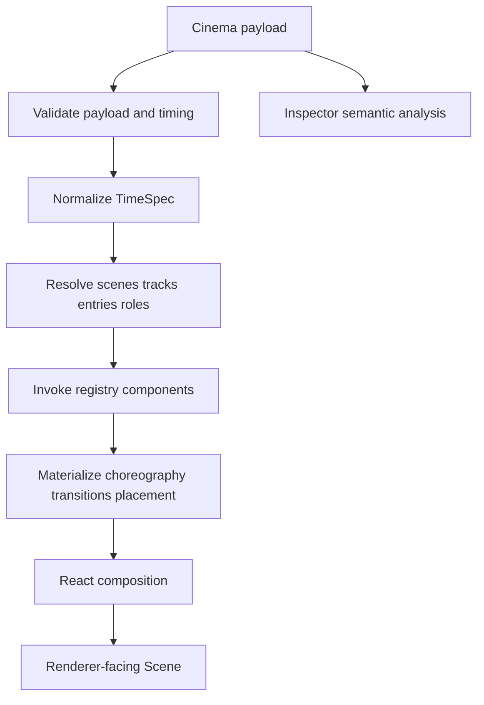

# Cinema compiler flow

Cinema preserves high-level identities during validation and inspection, then consumes many of them while constructing React elements. Roles, names, brand-token identity, choreography names, and transition names are generally not first-class Scene data.
