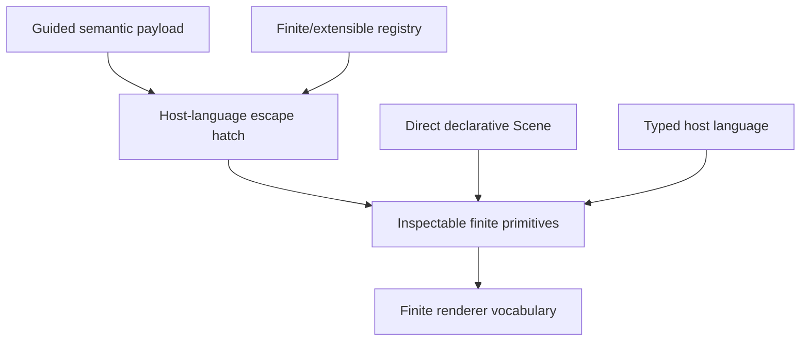

# Creative-programmability assessment

**Verdict:** MULTI_LAYER_PROGRAMMABILITY_WITH_FINITE_RENDERER_VOCABULARY. No numeric creativity score is assigned; every capability uses an evidence-backed categorical state that distinguishes native, host-language, registry, lower-level, finite-catalog, partial, and unknown support.

| Surface | primitives | procedural logic | custom animation | component extension | registry relation | descends to primitives | source mapping | black-box risk |
|---|---|---|---|---|---|---|---|---|
| AS-CINEMA | REQUIRES_LOWER_LEVEL_SCENE_ACCESS | SUPPORTED_THROUGH_CUSTOM_REGISTRY | SUPPORTED_THROUGH_CUSTOM_REGISTRY | SUPPORTED_THROUGH_CUSTOM_REGISTRY | SUPPORTED_THROUGH_CUSTOM_REGISTRY | SUPPORTED_THROUGH_CUSTOM_REGISTRY | PARTIALLY_SUPPORTED_BEFORE_LOWERING | MEDIUM |
| AS-REACT | SUPPORTED | SUPPORTED_THROUGH_HOST_LANGUAGE | SUPPORTED_THROUGH_HOST_LANGUAGE | SUPPORTED_THROUGH_HOST_LANGUAGE | NOT_NATIVE | SUPPORTED | PARTIALLY_SUPPORTED | LOW |
| AS-JSON | SUPPORTED | NOT_NATIVE | SUPPORTED | NOT_NATIVE | NOT_NATIVE | SUPPORTED | PARTIALLY_SUPPORTED | MEDIUM |
| AS-RUST | SUPPORTED | SUPPORTED_THROUGH_HOST_LANGUAGE | SUPPORTED_THROUGH_HOST_LANGUAGE | SUPPORTED_THROUGH_HOST_LANGUAGE | NOT_NATIVE | SUPPORTED | PARTIALLY_SUPPORTED | LOW |
| AS-COMPONENTS | REQUIRES_LOWER_LEVEL_SCENE_ACCESS | SUPPORTED_THROUGH_CUSTOM_REGISTRY | SUPPORTED_THROUGH_CUSTOM_REGISTRY | SUPPORTED_THROUGH_CUSTOM_REGISTRY | SUPPORTED_THROUGH_CUSTOM_REGISTRY | SUPPORTED_THROUGH_CUSTOM_REGISTRY | PARTIALLY_SUPPORTED_BEFORE_LOWERING | MEDIUM |

No numeric creativity score is used. Reusable components are not classified as fixed templates.
