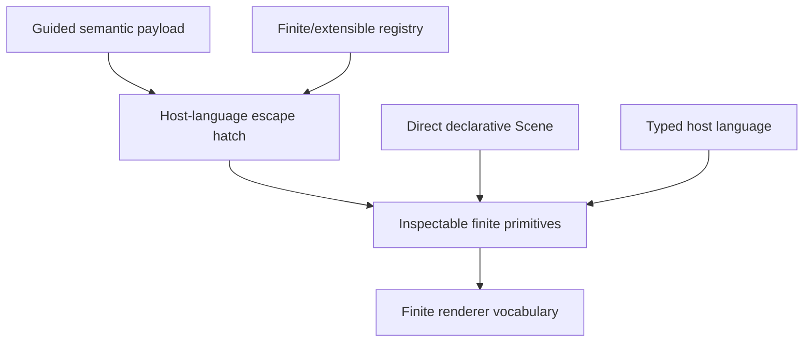

# Creative-programmability assessment

**Verdict:** MULTI_LAYER_PROGRAMMABILITY_WITH_FINITE_RENDERER_VOCABULARY. No numeric creativity score is assigned; each capability is an evidence-backed categorical finding.

| Surface | primitives | procedural logic | component extension | registry-dependent | descends to primitives | source mapping | black-box risk |
|---|---:|---:|---:|---:|---:|---:|---|
| AS-CINEMA | true | true | true | true | true | false | MEDIUM |
| AS-REACT | true | true | true | true | false | false | MEDIUM |
| AS-JSON | true | false | true | false | false | false | MEDIUM |
| AS-RUST | true | true | true | true | false | false | MEDIUM |
| AS-COMPONENTS | false | true | true | true | false | true | MEDIUM |

No numeric creativity score is used. Reusable components are not classified as fixed templates.
