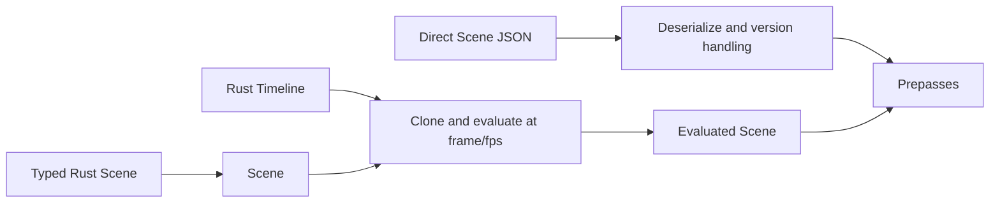

# Direct JSON and Rust flow

Direct JSON bypasses Cinema and React validation. Rust Scene and Timeline construction is **explicit and close to the renderer contract**; R0.02 makes no efficiency claim because benchmarking was prohibited.
