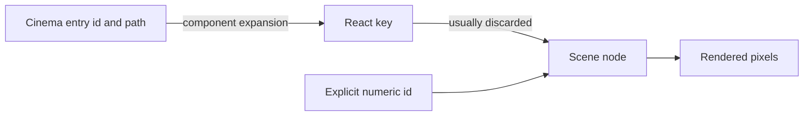

# Identity and source mapping

Cinema has string identities and payload paths used by inspection. React keys support reconciliation only inside one frame evaluation. Scene retains only optional numeric ids. There is no complete source-map chain from a rendered node back to Cinema intent.

## Evidence

- **C-001 — verified:** React authoring is programmatic, but its render boundary is a finite scene vocabulary. (confidence 0.99). Sources: S-REACT-HOST, S-REACT-LOWER, S-SCENE.
- **C-002 — verified:** React component state is not retained between output frames because every frame uses a fresh root that is unmounted. (confidence 0.99). Sources: S-REACT-LOWER, S-REACT-TEST.
- **C-003 — verified:** Cinema retains more editorial identity and intent than Scene, while its inspector is a parallel high-level analysis path. (confidence 0.98). Sources: S-CINEMA-TYPES, S-CINEMA-INSPECT, S-CINEMA-RESOLVE.
- **C-004 — verified:** Cinema roles, choreography names, brand identity, and most string ids do not survive as first-class Scene fields. (confidence 0.96). Sources: S-CINEMA-COMPILER, S-CINEMA-TYPES, S-SCENE.
- **C-005 — verified:** Direct Scene JSON and typed Rust construction converge at the same finite Scene contract. (confidence 0.99). Sources: S-SCENE, S-CLI, S-WASM.
- **C-006 — verified:** Layout, SVG, image, video, and timeline behavior includes destructive or materializing prepasses rather than a single immutable IR pipeline. (confidence 0.97). Sources: S-LAYOUT, S-SVG, S-IMAGE, S-VIDEO, S-CLI.
- **C-007 — verified:** GPU and CPU preview can share renderer semantics with native export, but browser media resolution and scheduling keep end-to-end parity conditional. (confidence 0.96). Sources: S-PLAYER, S-VIDEO, S-AUDIO, S-WASM, S-WASM-VELLO, S-CLI.
- **C-008 — verified:** Canvas2D is an explicit approximation and not a parity path. (confidence 0.99). Sources: S-CANVAS, S-PLAYER.
- **C-009 — verified:** Full React export materializes every evaluated frame before the native export call, creating duration-proportional scene memory and JSON I/O. (confidence 0.99). Sources: S-REACT-LOWER, S-NODE-EXPORT.
- **C-010 — verified:** Global registries and caches require explicit isolation if authoring evaluation is parallelized or made multi-tenant. (confidence 0.94). Sources: S-REACT-STATE, S-REACT-WARM, S-PLAYER, S-VIDEO.
- **C-011 — candidate:** A future CineKernel IR should preserve stable identity, semantic intent, time domains, diagnostics, and capability requirements until explicit lowering stages. (confidence 0.91). Sources: S-CINEMA-TYPES, S-CINEMA-RESOLVE, S-SCENE, E-MLIR, E-GSTREAMER.
- **C-012 — verified:** React's render and commit model is analogous only at a high level; ONDA deliberately remounts per frame rather than preserving a committed application tree. (confidence 0.97). Sources: S-REACT-LOWER, E-REACT.
