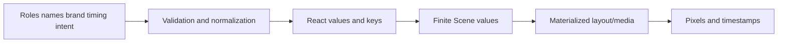

# Lowering and information loss

The register contains **31 semantic concepts**.

| Disposition | Count |
|---|---:|
| DROPPED | 8 |
| MATERIALIZED | 11 |
| NORMALIZED | 1 |
| PRESERVED | 4 |
| REMAPPED | 1 |
| UNRESOLVED | 1 |
| USED_ONLY_AS_REACT_KEY | 1 |
| USED_ONLY_DURING_LOWERING | 4 |

Every row records reversibility plus editing, diagnostic, agent-repair, and incremental-compilation impact.
