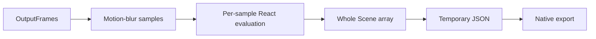

# Materialization and scalability

3 hypotheses are architectural predictions, not benchmark results.

- **M-001:** React full export memory and temporary JSON scale with frame count times scene size.. Evidence: S-REACT-LOWER, S-NODE-EXPORT.
- **M-002:** Motion blur multiplies authoring evaluations and materialized scenes by sample count.. Evidence: S-REACT-LOWER, S-NODE-EXPORT.
- **M-003:** Streaming evaluated scenes into a bounded renderer queue could remove whole-video scene materialization.. Evidence: S-NODE-EXPORT, E-GSTREAMER.

