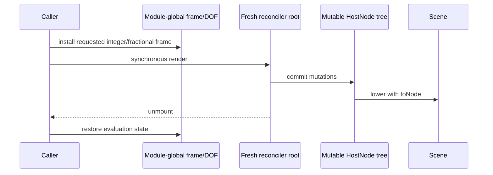

# React reconciler flow

A new root isolates each host tree and hook lifetime. It does **not** prove concurrent or nested reentrancy: module-global active frame and depth-of-field state remain shared. `renderFrames` accumulates the resulting Scene snapshots, while motion blur requests fractional subframes.
