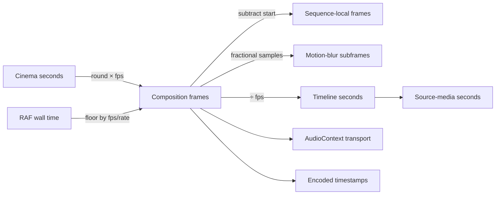

# State and time ownership

The model records **12 state owners** and **12 temporal conversions**.

| State | Scope | Authority | Mutability | Reentrancy finding |
|---|---|---|---|---|
| Cinema payload | serialized document | AUTHORITATIVE | IMMUTABLE_DATA | UNRESOLVED unless explicitly serialized; fresh React roots do not neutralize module-global state |
| React element evaluation | one requested frame | TRANSIENT | PER_FRAME_REBUILT | UNRESOLVED unless explicitly serialized; fresh React roots do not neutralize module-global state |
| module-level activeFrameState and activeDof | process/module | TRANSIENT | GLOBAL_MUTABLE | UNRESOLVED unless explicitly serialized; fresh React roots do not neutralize module-global state |
| HostNode tree | one reconciliation | TRANSIENT | MUTABLE_TREE | UNRESOLVED unless explicitly serialized; fresh React roots do not neutralize module-global state |
| Scene snapshot | frame/document | AUTHORITATIVE | IMMUTABLE_DATA | UNRESOLVED unless explicitly serialized; fresh React roots do not neutralize module-global state |
| Rust Timeline | document | AUTHORITATIVE | IMMUTABLE_DATA | UNRESOLVED unless explicitly serialized; fresh React roots do not neutralize module-global state |
| layout-resolved Scene | prepass | DERIVED | CLONED_AND_MUTATED | UNRESOLVED unless explicitly serialized; fresh React roots do not neutralize module-global state |
| image-resolved Scene | prepass/cache | CACHE | CACHE_MUTABLE | UNRESOLVED unless explicitly serialized; fresh React roots do not neutralize module-global state |
| player transport | component instance | PRESENTATION_ONLY | INSTANCE_MUTABLE | UNRESOLVED unless explicitly serialized; fresh React roots do not neutralize module-global state |
| GPU engine coordination | browser process | EXTERNAL_RUNTIME | GLOBAL_MUTABLE | UNRESOLVED unless explicitly serialized; fresh React roots do not neutralize module-global state |
| audio transport | AudioContext | EXTERNAL_RUNTIME | EXTERNAL_RUNTIME | UNRESOLVED unless explicitly serialized; fresh React roots do not neutralize module-global state |
| temporary frames JSON | export invocation | DERIVED | IMMUTABLE_DATA | UNRESOLVED unless explicitly serialized; fresh React roots do not neutralize module-global state |

Every conversion records rounding, clamping, negative/fractional behavior, rate ownership, and precision risk in the machine output.
