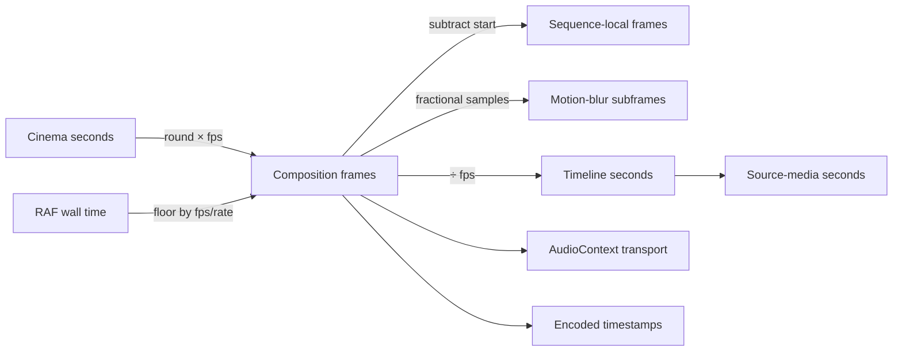

# State and time ownership

The model records **12 state owners** and **12 temporal conversions**.

| State | Created by | Scope | Versioned | Concurrency status | Reentrancy finding |
|---|---|---|---|---|---|
| Cinema payload | Cinema author or payload-producing tool | serialized document | UNKNOWN | SAFE_IF_CALLER_TREATS_PAYLOAD_AS_IMMUTABLE | UNRESOLVED unless explicitly evidenced; fresh React roots do not neutralize module-global state |
| React element evaluation | renderFrame for each requested frame | one requested frame | NO | PER_FRAME_ROOT_ISOLATED_BUT_GLOBAL_CONTEXT_UNRESOLVED | UNRESOLVED unless explicitly evidenced; fresh React roots do not neutralize module-global state |
| module-level activeFrameState and activeDof | renderFrame module assignment | process/module | NO | UNSAFE_SHARED_MUTABLE | UNRESOLVED unless explicitly evidenced; fresh React roots do not neutralize module-global state |
| HostNode tree | React reconciler commit | one reconciliation | NO | PER_RECONCILIATION_ISOLATED | UNRESOLVED unless explicitly evidenced; fresh React roots do not neutralize module-global state |
| Scene snapshot | React lowering, JSON caller, or Rust constructor | frame/document | YES | SAFE_AFTER_CONSTRUCTION_IF_IMMUTABLE | UNRESOLVED unless explicitly evidenced; fresh React roots do not neutralize module-global state |
| Rust Timeline | Rust caller or Scene deserializer | document | YES | SAFE_AFTER_CONSTRUCTION_IF_IMMUTABLE | UNRESOLVED unless explicitly evidenced; fresh React roots do not neutralize module-global state |
| layout-resolved Scene | layout prepass | prepass | INHERITS_SCENE_VERSION | PER_PREPASS_CLONE | UNRESOLVED unless explicitly evidenced; fresh React roots do not neutralize module-global state |
| image-resolved Scene | image prepass | prepass/cache | INHERITS_SCENE_VERSION | CALLER_CACHE_CONCURRENCY_UNRESOLVED | UNRESOLVED unless explicitly evidenced; fresh React roots do not neutralize module-global state |
| player transport | React Player instance | component instance | NO | REACT_INSTANCE_SCOPED | UNRESOLVED unless explicitly evidenced; fresh React roots do not neutralize module-global state |
| GPU engine coordination | Player module and supplied GPU engine | browser process | NO | SERIALIZED_PER_ENGINE; CROSS_ENGINE_STATUS_UNKNOWN | UNRESOLVED unless explicitly evidenced; fresh React roots do not neutralize module-global state |
| audio transport | PreviewAudio instance and browser AudioContext | AudioContext | NO | INSTANCE_SCOPED; EXTERNAL_RUNTIME_STATUS_UNKNOWN | UNRESOLVED unless explicitly evidenced; fresh React roots do not neutralize module-global state |
| temporary frames JSON | Node renderToFile invocation | export invocation | INHERITS_SCENE_VERSION | INVOCATION_LOCAL | UNRESOLVED unless explicitly evidenced; fresh React roots do not neutralize module-global state |

Every conversion records rounding, clamping, negative/fractional behavior, rate ownership, and precision risk in the machine output.
