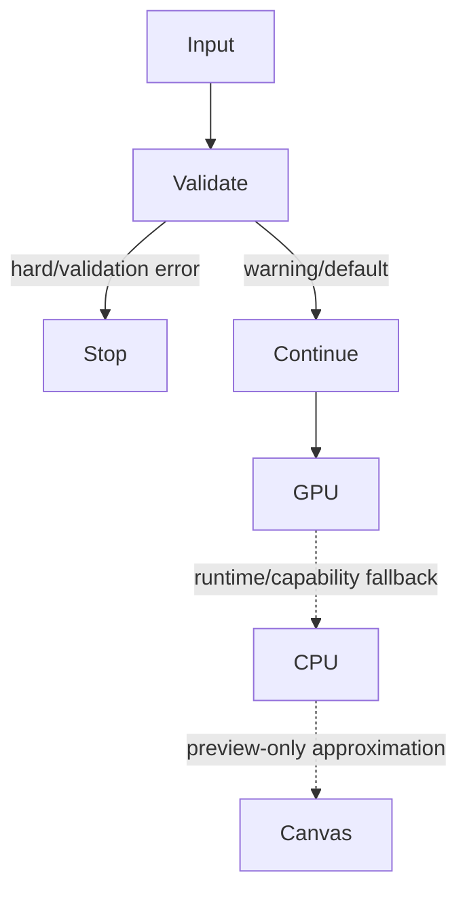

# Validation, errors, and fallbacks

22 behaviors cover the mandatory error and fallback cases.

| Surface | Trigger | Behavior | Diagnostic visibility | Agent informed | Visual outcome |
|---|---|---|---|---:|---|
| Cinema compiler | unknown component | VALIDATION_ERROR | STRUCTURED_DIAGNOSTIC | true | visible diagnostic placeholder or build failure |
| Cinema compiler | unknown choreography | WARNING | STRUCTURED_DIAGNOSTIC | true | static/default motion |
| Cinema compiler | unknown transition | WARNING | STRUCTURED_DIAGNOSTIC | true | cut/default transition |
| Cinema property adaptation | unknown property | MALFORMED_VALUE_DROPPED | SILENT_SKIP | false | default or unchanged primitive value |
| Cinema timing validation | invalid time specification | VALIDATION_ERROR | STRUCTURED_DIAGNOSTIC | true | build stops |
| React finish parser | malformed finish or LUT | DEFAULT_SUBSTITUTION | STRUCTURED_DIAGNOSTIC | true | default finish |
| React reconciler | unsupported React host element | HARD_ERROR | STRUCTURED_DIAGNOSTIC | true | frame evaluation stops |
| React reconciler | raw text in non-Text parent | HARD_ERROR | STRUCTURED_DIAGNOSTIC | true | frame evaluation stops |
| React reconciler | missing root Composition | HARD_ERROR | STRUCTURED_DIAGNOSTIC | true | frame evaluation stops |
| renderer capability boundary | GPU-only component on CPU | UNSUPPORTED | STRUCTURED_DIAGNOSTIC | true | placeholder, omission, or failure depending component |
| Canvas2D preview | component outside Canvas subset | APPROXIMATION | UI_STATUS_ONLY | false | approximate or omitted rendering |
| Player WebGPU loop | GPU renderer throws | AUTOMATIC_BACKEND_FALLBACK | SILENT_STATE_DEMOTION | false | next render uses CPU or Canvas |
| Player CPU drawer | CPU renderer throws | AUTOMATIC_BACKEND_FALLBACK | SILENT_STATE_DEMOTION | false | current and later frames use Canvas2D |
| Player font bridge | engine rejects a registered font | SILENT_IGNORE | SILENT_SKIP | false | preview continues with fallback font; no retry or repaint is requested |
| Player image resolver | image fetch returns non-OK or throws | SILENT_IGNORE | SILENT_SKIP | false | unresolved image remains blank and renderer skips it |
| Player video resolver | cross-origin video cannot be read through Canvas | DEFAULT_SUBSTITUTION | STDERR_ONLY | false | preview-only media element overlay |
| Node export bridge | malformed progress JSON line | MALFORMED_VALUE_DROPPED | SILENT_SKIP | false | export continues without that progress event |
| Node export bridge | CLI exits nonzero | HARD_ERROR | STDERR_ONLY | true | caller receives process error with captured stderr |
| native CLI Scene boundary | direct JSON deserialization fails | HARD_ERROR | STDERR_ONLY | true | command exits with parse context |
| Scene serialization boundary | future scene version | UNSUPPORTED | STRUCTURED_DIAGNOSTIC | true | reject or retain version depending boundary |
| Scene serialization boundary | unknown scene fields | UNKNOWN | SILENT_SKIP | false | serde behavior requires a dedicated fixture |
| native render materialization prepass | http(s) media source | BEST_EFFORT_MATERIALIZATION | STDERR_ONLY | true | decoder later skips an unresolved URL without aborting render |

