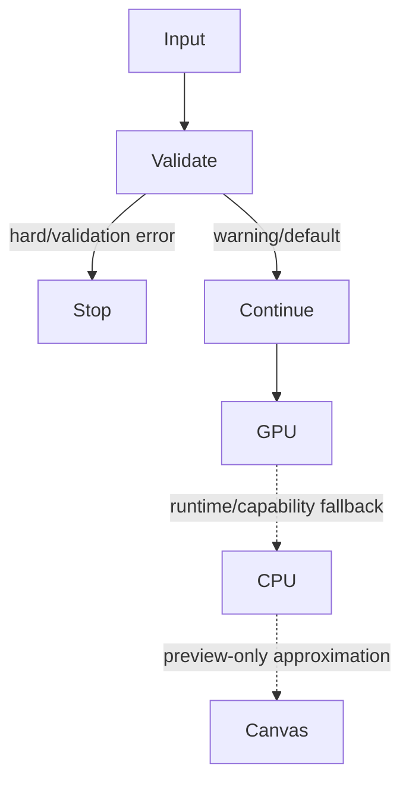

# Validation, errors, and fallbacks

21 behaviors cover the mandatory error and fallback cases.

| Trigger | Behavior | Informed | Quality reducing | Visual outcome |
|---|---|---:|---:|---|
| unknown component | VALIDATION_ERROR | true | false | visible build placeholder or stop |
| unknown choreography | WARNING | true | false | static or default motion |
| unknown transition | WARNING | true | false | cut/default transition |
| unknown property | MALFORMED_VALUE_DROPPED | false | false | default or unchanged value |
| invalid time specification | VALIDATION_ERROR | true | false | build stops |
| malformed finish or LUT | DEFAULT_SUBSTITUTION | true | true | default finish |
| unsupported React host element | HARD_ERROR | true | false | evaluation stops |
| raw text in wrong parent | HARD_ERROR | true | false | evaluation stops |
| missing root Composition | HARD_ERROR | true | false | evaluation stops |
| GPU-only component on CPU | UNSUPPORTED | true | false | placeholder, omission, or failure |
| degraded component fidelity | APPROXIMATION | true | true | approximate rendering |
| renderer runtime failure | AUTOMATIC_BACKEND_FALLBACK | true | true | GPU to CPU |
| CPU renderer failure | AUTOMATIC_BACKEND_FALLBACK | true | true | CPU to Canvas preview |
| failed font load | ASYNC_RETRY_OR_REPAINT | true | false | retry or repaint |
| missing image | VISUAL_PLACEHOLDER | true | true | placeholder or skipped draw |
| cross-origin video preview | DEFAULT_SUBSTITUTION | true | true | media-element fallback |
| malformed progress message | MALFORMED_VALUE_DROPPED | false | false | continue without update |
| CLI process failure | HARD_ERROR | true | false | process error |
| direct JSON deserialization | HARD_ERROR | true | false | parse failure |
| future scene version | UNSUPPORTED | true | false | reject or retain version depending boundary |
| unknown scene fields | UNKNOWN | false | false | serde behavior requires fixture |

