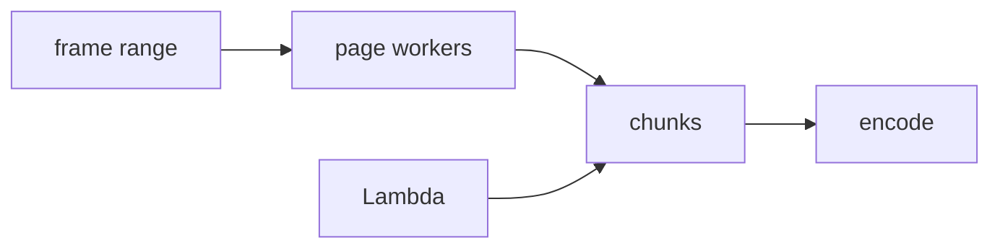

# Concurrency and distribution

Pinned source: `4e459b8b3aeec12ac8346666773ea28892a30e31`. The checkout is detached and verified before research. State is owned by React/browser packages; CineKernel treats this as evidence for a wrapped compatibility renderer, not future authoritative state.

| Package / decision | Entrypoint or evidence | Control flow / finding |
|---|---|---|
| renderer | [packages/renderer/src/render-frames.ts](https://github.com/remotion-dev/remotion/blob/4e459b8b3aeec12ac8346666773ea28892a30e31/packages/renderer/src/render-frames.ts) | local worker scheduling |
| renderer | [packages/renderer/src/render-frame-and-retry-target-close.ts](https://github.com/remotion-dev/remotion/blob/4e459b8b3aeec12ac8346666773ea28892a30e31/packages/renderer/src/render-frame-and-retry-target-close.ts) | retry boundary |
| lambda | [packages/lambda/src/shared/chunk.ts](https://github.com/remotion-dev/remotion/blob/4e459b8b3aeec12ac8346666773ea28892a30e31/packages/lambda/src/shared/chunk.ts) | distributed chunk contract |

Timing is frame-derived; browser pages own evaluation, renderer workers own capture concurrency, and errors cross explicit promise/process boundaries. Preview and final paths share composition semantics but not identical capture/encode machinery. Recommendation confidence is medium until the full correctness matrix runs.

