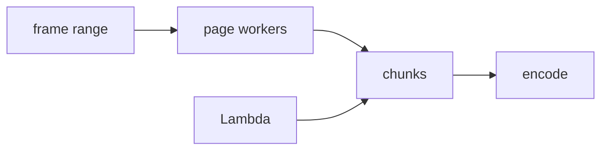

# Concurrency and distribution

Pinned source: `4e459b8b3aeec12ac8346666773ea28892a30e31`. The checkout is detached and verified before research. State is owned by React/browser packages; CineKernel treats this as evidence for a wrapped compatibility renderer, not future authoritative state.

| Package / decision | Entrypoint or evidence | Control flow / finding |
|---|---|---|
| renderer | [packages/renderer/src/render-frames.ts](https://github.com/remotion-dev/remotion/blob/4e459b8b3aeec12ac8346666773ea28892a30e31/packages/renderer/src/render-frames.ts) | local worker scheduling |
| renderer | [packages/renderer/src/render-frame-and-retry-target-close.ts](https://github.com/remotion-dev/remotion/blob/4e459b8b3aeec12ac8346666773ea28892a30e31/packages/renderer/src/render-frame-and-retry-target-close.ts) | retry boundary |
| lambda | [packages/lambda/src/shared/chunk.ts](https://github.com/remotion-dev/remotion/blob/4e459b8b3aeec12ac8346666773ea28892a30e31/packages/lambda/src/shared/chunk.ts) | distributed chunk contract |

Timing is frame-derived; browser pages own evaluation, renderer workers own capture concurrency, and errors cross explicit promise/process boundaries. Preview and final paths share composition semantics but not identical capture/encode machinery. Recommendation confidence is medium until the full correctness matrix runs.

## Concrete trace and ownership

`renderFrames()` wraps `internalRenderFrames`; `innerRenderFrames` schedules frame numbers onto a browser page pool and returns `FrameAndAssets`. The constant `MAX_RETRIES_PER_FRAME` bounds frame retry. `render-frame-and-retry-target-close.ts` isolates a closed-target recovery case rather than retrying arbitrary deterministic failures. Completion order is a scheduling property; the frame number remains the semantic key.

Local resource ownership belongs to the page pool, Chromium processes, downloaded assets, temporary frame files, and FFmpeg. Cancellation must close pages and children. CineKernel therefore supervises the entire engine process tree with heartbeats, RSS/temp-disk sampling, wall/stall deadlines, graceful termination, and forced tree kill. Warm-up is a separate untimed attempt and its failure aborts the group.

Lambda's shared chunk contract partitions frame ranges and later combines them. That design informs a future CineKernel distributed protocol, but Lambda storage/retry/assembly is not exercised by Phase 0.1 and is not counted as proven reuse. Local worker modes are measured explicitly: Remotion media runs at default, 1, and 4 concurrency; five repetitions per mode prevent a single favorable schedule from defining the result.

Preview is normally single interactive state, while final rendering can use multiple isolated pages and out-of-order completion. Cache warming and browser reuse can affect performance, so measurements record mode and repetition and do not merge historical runs. Decision: **derive** ordinal frame scheduling and bounded retry, **reimplement** process supervision and canonical evidence selection, **wrap** Remotion local concurrency, and defer distributed adoption. Confidence: **high** for local scheduling structure, **low** for Lambda operational equivalence until a dedicated phase.
