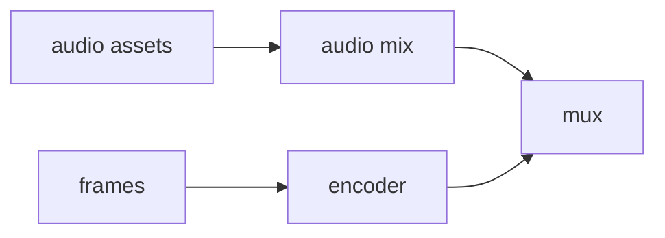

# Encoding and muxing

Pinned source: `4e459b8b3aeec12ac8346666773ea28892a30e31`. The checkout is detached and verified before research. State is owned by React/browser packages; CineKernel treats this as evidence for a wrapped compatibility renderer, not future authoritative state.

| Package / decision | Entrypoint or evidence | Control flow / finding |
|---|---|---|
| renderer | [packages/renderer/src/ffmpeg-args.ts](https://github.com/remotion-dev/remotion/blob/4e459b8b3aeec12ac8346666773ea28892a30e31/packages/renderer/src/ffmpeg-args.ts) | encoder construction |
| renderer | [packages/renderer/src/combine-audio.ts](https://github.com/remotion-dev/remotion/blob/4e459b8b3aeec12ac8346666773ea28892a30e31/packages/renderer/src/combine-audio.ts) | audio assembly |
| renderer | [packages/renderer/src/stitch-frames-to-video.ts](https://github.com/remotion-dev/remotion/blob/4e459b8b3aeec12ac8346666773ea28892a30e31/packages/renderer/src/stitch-frames-to-video.ts) | final mux |

Timing is frame-derived; browser pages own evaluation, renderer workers own capture concurrency, and errors cross explicit promise/process boundaries. Preview and final paths share composition semantics but not identical capture/encode machinery. Recommendation confidence is medium until the full correctness matrix runs.

## Concrete trace and ownership

`stitchFramesToVideo()` enters `internalStitchFramesToVideo()` and `innerStitchFramesToVideo()`. Encoder arguments are produced by the FFmpeg argument builders from codec, pixel format, CRF, preset, color-space, and frame-rate options. Audio assets collected from pages are assembled through `combine-audio.ts`; the resulting sidecar and pre-encoded video are mapped into the final container. Process exit, stderr, and cleanup are the error boundary—no successful child exit is treated as sufficient artifact proof by CineKernel.

The renderer owns temporary frame/audio paths and FFmpeg lifecycle. The composition frame count owns video duration; registered audio intervals own the mix graph. Remotion may parallel-encode a pre-encode stream, but final mux order is explicit. CineKernel fixes H.264, yuv420p, CRF 18, x264 medium, PNG intermediates, and BT.709. Audio cases request AAC 192k; no-audio cases pass `--muted` and must contain zero audio tracks.

Retries happen before or around frame capture, not by silently accepting a partial mux. Audio preprocessing and FFmpeg failures reject. Cache behavior is limited to inputs/intermediates and cannot waive final checks. Preview does not exercise final H.264/AAC muxing, codec delay, fast-start, or container timestamp tables.

Our verifier checks one video track, the declared audio-track count, codec, pixel format, dimensions, frame rate, time base, start time, duration, frame count, decoded count, monotonic timestamps, black/frozen runs, audio sample count with AAC tolerance, clipping, three spectral signatures, silence, and seam jumps. Decision: **wrap** the mature encoder path, **derive** option normalization, **reimplement** artifact verification, and **reject** opaque default encoder settings for comparable benchmarks. Confidence: **high** for local MP4 evidence; **medium** for hardware encoders and other containers.
