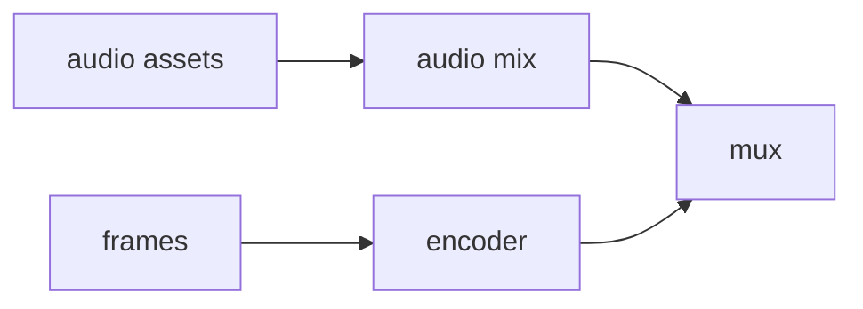

# Encoding and muxing

Pinned source: `4e459b8b3aeec12ac8346666773ea28892a30e31`. The checkout is detached and verified before research. State is owned by React/browser packages; CineKernel treats this as evidence for a wrapped compatibility renderer, not future authoritative state.

| Package / decision | Entrypoint or evidence | Control flow / finding |
|---|---|---|
| renderer | [packages/renderer/src/ffmpeg-args.ts](https://github.com/remotion-dev/remotion/blob/4e459b8b3aeec12ac8346666773ea28892a30e31/packages/renderer/src/ffmpeg-args.ts) | encoder construction |
| renderer | [packages/renderer/src/combine-audio.ts](https://github.com/remotion-dev/remotion/blob/4e459b8b3aeec12ac8346666773ea28892a30e31/packages/renderer/src/combine-audio.ts) | audio assembly |
| renderer | [packages/renderer/src/stitch-frames-to-video.ts](https://github.com/remotion-dev/remotion/blob/4e459b8b3aeec12ac8346666773ea28892a30e31/packages/renderer/src/stitch-frames-to-video.ts) | final mux |

Timing is frame-derived; browser pages own evaluation, renderer workers own capture concurrency, and errors cross explicit promise/process boundaries. Preview and final paths share composition semantics but not identical capture/encode machinery. Recommendation confidence is medium until the full correctness matrix runs.

