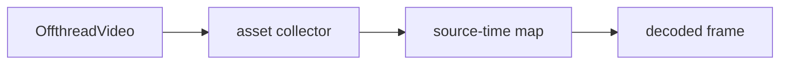

# Media and source-frame sampling

Pinned source: `4e459b8b3aeec12ac8346666773ea28892a30e31`. The checkout is detached and verified before research. State is owned by React/browser packages; CineKernel treats this as evidence for a wrapped compatibility renderer, not future authoritative state.

| Package / decision | Entrypoint or evidence | Control flow / finding |
|---|---|---|
| core | [packages/core/src/video/OffthreadVideo.tsx](https://github.com/remotion-dev/remotion/blob/4e459b8b3aeec12ac8346666773ea28892a30e31/packages/core/src/video/OffthreadVideo.tsx) | source-frame declaration |
| renderer | [packages/renderer/src/assets/download-map.ts](https://github.com/remotion-dev/remotion/blob/4e459b8b3aeec12ac8346666773ea28892a30e31/packages/renderer/src/assets/download-map.ts) | asset materialization |
| media-parser | [packages/media-parser/src/parse-media.ts](https://github.com/remotion-dev/remotion/blob/4e459b8b3aeec12ac8346666773ea28892a30e31/packages/media-parser/src/parse-media.ts) | container parsing |

Timing is frame-derived; browser pages own evaluation, renderer workers own capture concurrency, and errors cross explicit promise/process boundaries. Preview and final paths share composition semantics but not identical capture/encode machinery. Recommendation confidence is medium until the full correctness matrix runs.

## Concrete trace and ownership

`OffthreadVideo` is the author-facing declaration; `InnerOffthreadVideo` translates `trimBefore`, playback rate, volume/mute state, and the current composition frame into media work. During final rendering, asset collection materializes referenced media through the renderer download map. The media parser's `parseMedia()` establishes tracks, duration, samples, and seekable container structure; the renderer's `seekToFrame()` and `waitForReady()` form the browser synchronization boundary before capture.

The composition owns the desired source-time mapping, the parser owns container facts, the renderer page owns decoded-frame readiness, and the download map owns local materialization. Browser media caches and keyframe banks are resource optimizations; they must not change `output n → source n + trim`. Page-level readiness failures propagate to the frame retry boundary, while missing/corrupt assets fail the render. Preview may use continuous playback and browser buffering; final render explicitly seeks frames and therefore exercises a different failure surface.

Phase 0.1 tests this path with a 240-frame, 30 fps, permutation-separated color codebook, a 15-frame trim, and a complete decoded-source oracle for all 180 output frames. The source MP4 has bounded GOPs and fast-start metadata. Every output is decoded again, compared with the actual decoded source frame under a documented color-conversion tolerance, and rejected on the first mapping failure. Five repetitions at each required worker mode cover random-access/concurrency instability.

Known-issue relevance: sparse keyframes, asynchronous decode readiness, browser cache eviction, and fractional timestamp rounding can all manifest as frozen, duplicated, or adjacent frames. Decision: **wrap** Remotion media semantics, **reimplement** the independent oracle and provenance layer, and **reject** renderer self-report as proof. Confidence: **high** for the benchmarked MP4/H.264 path; **medium** for formats not in this matrix.
