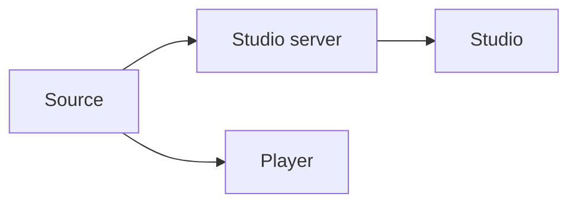

# Player and Studio

Pinned source: `4e459b8b3aeec12ac8346666773ea28892a30e31`. The checkout is detached and verified before research. State is owned by React/browser packages; CineKernel treats this as evidence for a wrapped compatibility renderer, not future authoritative state.

| Package / decision | Entrypoint or evidence | Control flow / finding |
|---|---|---|
| player | [packages/player/src/Player.tsx](https://github.com/remotion-dev/remotion/blob/4e459b8b3aeec12ac8346666773ea28892a30e31/packages/player/src/Player.tsx) | embedded playback |
| studio | [packages/studio/src/Root.tsx](https://github.com/remotion-dev/remotion/blob/4e459b8b3aeec12ac8346666773ea28892a30e31/packages/studio/src/Root.tsx) | Studio surface |
| studio-server | [packages/studio-server/src/index.ts](https://github.com/remotion-dev/remotion/blob/4e459b8b3aeec12ac8346666773ea28892a30e31/packages/studio-server/src/index.ts) | server boundary |

Timing is frame-derived; browser pages own evaluation, renderer workers own capture concurrency, and errors cross explicit promise/process boundaries. Preview and final paths share composition semantics but not identical capture/encode machinery. Recommendation confidence is medium until the full correctness matrix runs.

## Concrete trace and ownership

`Player` is the embedded playback entry and owns interactive play/pause, current-frame presentation, and event-facing controls. Studio's `Root` assembles the editor UI, while `studio-server` owns bundling, file watching, HTTP serving, and renderer-facing project access. These surfaces consume composition definitions but do not own the final encoded artifact.

Interactive time is user/clock driven and can advance continuously; render time is frame/fps driven and seeked. Player state, Studio editor state, and browser media state are therefore preview owners only. Final rendering creates controlled pages, waits for readiness, captures exact frames, collects assets/audio, and muxes. Errors in Studio can be displayed and recovered interactively; final errors must reject the run. Hot-reload and dev-server caches are deliberately outside canonical measurements.

The preview/final split matters for fonts, media seeks, 3D GPU completion, layout, and animations whose implementation accidentally depends on requestAnimationFrame history. Probe D snapshots multiple authored times through preview/capture paths and compares them with final-frame extractions using numeric image metrics. The central verifier remains authoritative for the final MP4.

Decision: **wrap** Player/Studio for Remotion compatibility and author inspection, **derive** inspectable composition metadata and explicit readiness, **reimplement** CineKernel-native preview around future VideoIR, and **reject** preview success as render correctness evidence. Confidence: **high** on ownership boundaries; **medium** on exact visual parity until Probe D passes remotely.
