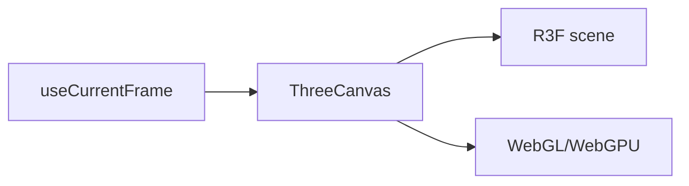

# Three.js and WebGPU

Pinned source: `4e459b8b3aeec12ac8346666773ea28892a30e31`. The checkout is detached and verified before research. State is owned by React/browser packages; CineKernel treats this as evidence for a wrapped compatibility renderer, not future authoritative state.

| Package / decision | Entrypoint or evidence | Control flow / finding |
|---|---|---|
| three | [packages/three/src/ThreeCanvas.tsx](https://github.com/remotion-dev/remotion/blob/4e459b8b3aeec12ac8346666773ea28892a30e31/packages/three/src/ThreeCanvas.tsx) | R3F canvas and frame-driven render |
| three | [packages/three/src/webgpu.tsx](https://github.com/remotion-dev/remotion/blob/4e459b8b3aeec12ac8346666773ea28892a30e31/packages/three/src/webgpu.tsx) | WebGPU integration |
| core | [packages/core/src/use-current-frame.ts](https://github.com/remotion-dev/remotion/blob/4e459b8b3aeec12ac8346666773ea28892a30e31/packages/core/src/use-current-frame.ts) | deterministic time source |

Timing is frame-derived; browser pages own evaluation, renderer workers own capture concurrency, and errors cross explicit promise/process boundaries. Preview and final paths share composition semantics but not identical capture/encode machinery. Recommendation confidence is medium until the full correctness matrix runs.

## Concrete trace and ownership

`ThreeCanvas` delegates to `ThreeCanvasInternals`; `ManualFrameRenderer` synchronizes React Three Fiber rendering with the current Remotion frame. `ThreeCanvasProps` and `ThreeCanvasFrameRendererProps` describe the host/callback boundary. For WebGPU, `ThreeWebGPUCanvas` constructs a renderer through `createWebGPURenderer`; `WebGPUFrameRenderer` and `waitForGpu` ensure submitted work is complete before the frame is considered rendered.

The composition owns camera/object parameters as a function of `useCurrentFrame()`. Three/R3F owns scene graph and GPU resources; the browser owns adapter/device/context. The renderer owns the capture boundary. Initialization and device errors propagate through React/browser render failure. There is no safe generic retry for device loss without reconstructing state; caches of shaders/textures are optimizations and must remain seek-safe.

Studio/player previews may continuously animate and retain GPU state. Final rendering seeks exact frames, may use several pages, and must wait for GPU completion per page. Phase 0.1 uses a real local texture, lit rotating cube, moving camera, depth-tested floor, and 2D label; decoded checkpoint diversity and preview/final probe comparisons prevent a static rectangle from passing as 3D.

The browser stack remains a compatibility path. CineKernel's native wgpu feasibility renderer separately records adapter, backend, driver, device type, software fallback, and `device.poll(Maintain::Wait)`. Decision: **wrap** Remotion Three for imported projects, **derive** explicit completion barriers, **reimplement** authoritative native 3D, and **reject** an unclassified software fallback as GPU evidence. Confidence: **medium-high** for WebGL/Three; **medium** for WebGPU across CI platforms.
